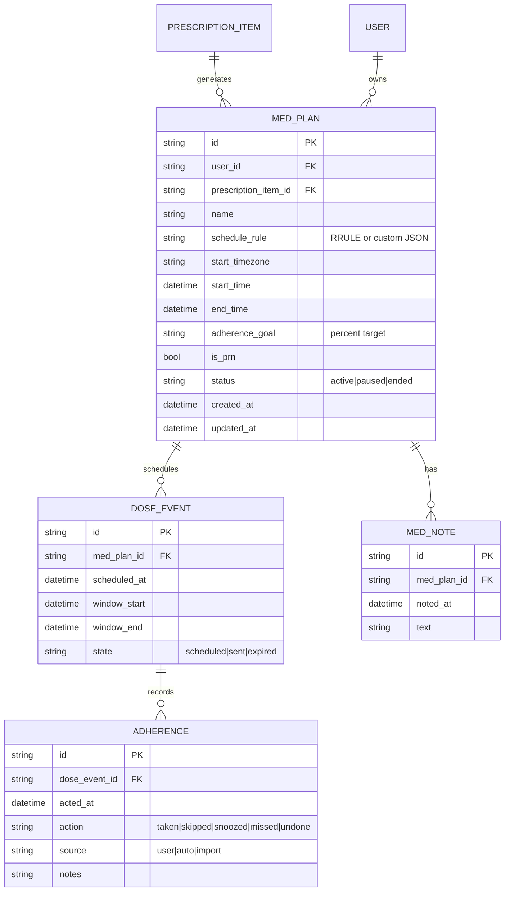
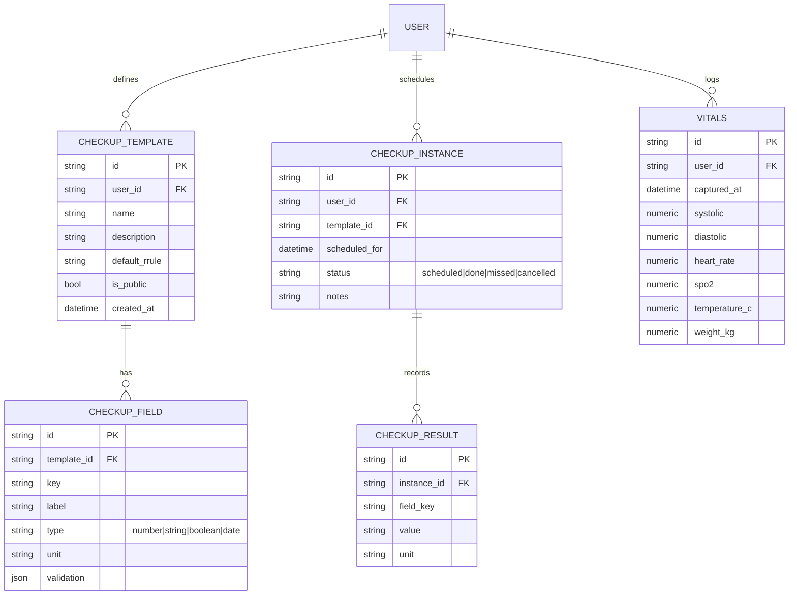
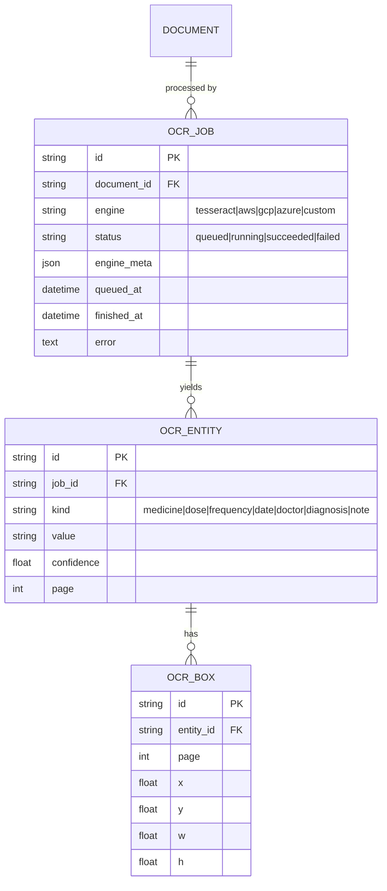
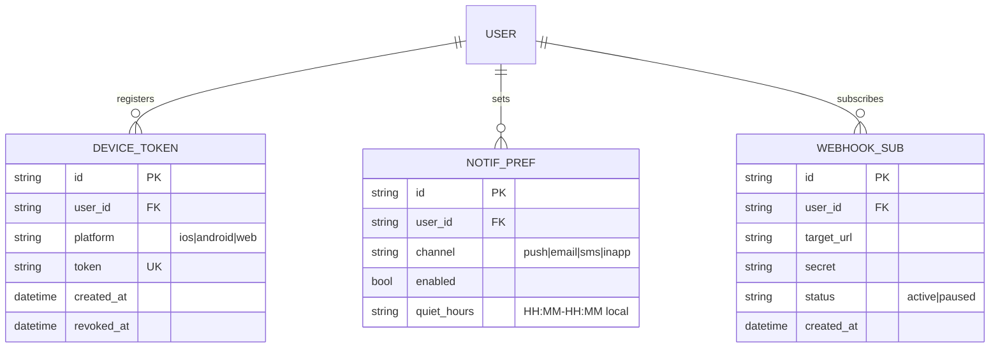

# API_CONTRACT.md – Care App

This document defines the "contract" between the frontend and backend for the Care App. It is the single source of truth for all API communication.

---

## Features & Endpoints

---

### Authentication

#### 1. User Registration
- **HTTP Method:** `POST`
- **Endpoint Path:** `/api/auth/register`
- **Description:** Registers a new user.
- **Request Body:**
```json
{
  "name": "John Doe",
  "email": "john@example.com",
  "password": "securepassword"
}
```
- **Success Response (200 OK):**
```json
{
  "message": "User registered successfully",
  "userId": "abc123"
}
```
- **Error Responses:**
```json
{
  "error": "Email already exists"
}
```

#### 2. User Login
- **HTTP Method:** `POST`
- **Endpoint Path:** `/api/auth/login`
- **Description:** Authenticates user and returns token.
- **Request Body:**
```json
{
  "email": "john@example.com",
  "password": "securepassword"
}
```
- **Success Response:**
```json
{
  "token": "jwt.token.string",
  "userId": "abc123"
}
```

#### 3. User Logout
- **HTTP Method:** `POST`
- **Endpoint Path:** `/api/auth/logout`
- **Description:** Invalidates user session/token.
- **Success Response:**
```json
{ "message": "Logged out successfully" }
```

---

### Dashboard

#### 4. Fetch Dashboard Overview
- **HTTP Method:** `GET`
- **Endpoint Path:** `/api/dashboard`
- **Description:** Retrieves latest documents, upcoming reminders, and health timeline preview.
- **Success Response:**
```json
{
  "recentDocuments": [...],
  "upcomingReminders": [...],
  "timelinePreview": [...]
}
```

---

### Documents

#### 5. Upload Document (with OCR)
- **HTTP Method:** `POST`
- **Endpoint Path:** `/api/documents/upload`
- **Description:** Uploads a document to storage and processes OCR for metadata extraction.
- **Request Body (Multipart):**
```
file: PDF/Image
```
- **Success Response:**
```json
{
  "documentId": "doc123",
  "category": "Prescription",
  "metadata": {
    "doctorName": "Dr. Smith",
    "date": "2025-08-10",
    "diagnosis": "Flu",
    "prescription": ["Medicine A", "Medicine B"]
  }
}
```

#### 6. Get Document Details
- **HTTP Method:** `GET`
- **Endpoint Path:** `/api/documents/:id`
- **Description:** Retrieves metadata and file URL for a specific document.

#### 7. Search & Filter Documents
- **HTTP Method:** `GET`
- **Endpoint Path:** `/api/documents/search?query=flu&category=Prescription`
- **Description:** Searches documents by keywords, doctor, category, or tags.

---

### Reminders

#### 8. Create Reminder
- **HTTP Method:** `POST`
- **Endpoint Path:** `/api/reminders`
- **Request Body:**
```json
{
  "documentId": "doc123",
  "medicine": "Paracetamol",
  "time": "2025-08-10T09:00:00Z",
  "repeat": "daily"
}
```

#### 9. Get All Reminders
- **HTTP Method:** `GET`
- **Endpoint Path:** `/api/reminders`

#### 10. Delete Reminder
- **HTTP Method:** `DELETE`
- **Endpoint Path:** `/api/reminders/:id`

---

### QR Code

#### 11. Generate QR Code for Document
- **HTTP Method:** `POST`
- **Endpoint Path:** `/api/documents/:id/qr`
- **Description:** Generates a QR code for a document’s secure view-only link.
- **Success Response:**
```json
{
  "qrCodeUrl": "https://storage.careapp.com/qrcodes/doc123.png"
}
```

---

### Profile & Settings

#### 12. Get Profile
- **HTTP Method:** `GET`
- **Endpoint Path:** `/api/profile`

#### 13. Update Profile
- **HTTP Method:** `PUT`
- **Endpoint Path:** `/api/profile`
- **Request Body:**
```json
{
  "name": "John Doe",
  "notificationsEnabled": true,
  "privacy": "private"
}
```
### Export Data

#### 14. Download Full Medical History
- **HTTP Method:** `GET`
- **Endpoint Path:** `/api/documents/export`
- **Description:** Returns a ZIP/PDF of all documents and metadata.
```

---
---

## Feature Data Models

Below are feature-specific data models extending the core schema. Each block shows the intent, key tables, and SQL-ish definitions you can adapt for PostgreSQL.

### A) Medication Management (Adherence Tracking)

**Intent:** Convert prescription items into actionable medication plans, track taken/missed doses, and support PRN (as-needed) meds.



**Tables**
```sql
CREATE TABLE med_plans (
  id UUID PRIMARY KEY,
  user_id UUID NOT NULL REFERENCES users(id) ON DELETE CASCADE,
  prescription_item_id UUID REFERENCES prescription_items(id) ON DELETE SET NULL,
  name TEXT NOT NULL,
  schedule_rule JSONB, -- store RRULE + optional times-of-day list
  start_timezone TEXT NOT NULL,
  start_time TIMESTAMPTZ NOT NULL,
  end_time TIMESTAMPTZ,
  adherence_goal INTEGER CHECK (adherence_goal BETWEEN 0 AND 100),
  is_prn BOOLEAN NOT NULL DEFAULT FALSE,
  status TEXT NOT NULL DEFAULT 'active' CHECK (status IN ('active','paused','ended')),
  created_at TIMESTAMPTZ NOT NULL DEFAULT now(),
  updated_at TIMESTAMPTZ NOT NULL DEFAULT now()
);

CREATE TABLE dose_events (
  id UUID PRIMARY KEY,
  med_plan_id UUID NOT NULL REFERENCES med_plans(id) ON DELETE CASCADE,
  scheduled_at TIMESTAMPTZ NOT NULL,
  window_start TIMESTAMPTZ,
  window_end TIMESTAMPTZ,
  state TEXT NOT NULL DEFAULT 'scheduled' CHECK (state IN ('scheduled','sent','expired'))
);
CREATE INDEX ON dose_events (med_plan_id, scheduled_at);

CREATE TABLE adherence (
  id UUID PRIMARY KEY,
  dose_event_id UUID NOT NULL REFERENCES dose_events(id) ON DELETE CASCADE,
  acted_at TIMESTAMPTZ NOT NULL,
  action TEXT NOT NULL CHECK (action IN ('taken','skipped','snoozed','missed','undone')),
  source TEXT CHECK (source IN ('user','auto','import')),
  notes TEXT
);
CREATE INDEX ON adherence (dose_event_id, acted_at);

CREATE TABLE med_notes (
  id UUID PRIMARY KEY,
  med_plan_id UUID NOT NULL REFERENCES med_plans(id) ON DELETE CASCADE,
  noted_at TIMESTAMPTZ NOT NULL DEFAULT now(),
  text TEXT
);
```

---

### B) Health Checkups & Vitals

**Intent:** Remind periodic health checkups, store results, and optional vitals snapshots.



**Tables**
```sql
CREATE TABLE checkup_templates (
  id UUID PRIMARY KEY,
  user_id UUID REFERENCES users(id) ON DELETE SET NULL, -- null for system templates
  name TEXT NOT NULL,
  description TEXT,
  default_rrule TEXT,
  is_public BOOLEAN NOT NULL DEFAULT FALSE,
  created_at TIMESTAMPTZ NOT NULL DEFAULT now()
);

CREATE TABLE checkup_fields (
  id UUID PRIMARY KEY,
  template_id UUID NOT NULL REFERENCES checkup_templates(id) ON DELETE CASCADE,
  key TEXT NOT NULL,
  label TEXT NOT NULL,
  type TEXT NOT NULL CHECK (type IN ('number','string','boolean','date')),
  unit TEXT,
  validation JSONB
);

CREATE TABLE checkup_instances (
  id UUID PRIMARY KEY,
  user_id UUID NOT NULL REFERENCES users(id) ON DELETE CASCADE,
  template_id UUID REFERENCES checkup_templates(id) ON DELETE SET NULL,
  scheduled_for TIMESTAMPTZ NOT NULL,
  status TEXT NOT NULL DEFAULT 'scheduled' CHECK (status IN ('scheduled','done','missed','cancelled')),
  notes TEXT
);
CREATE INDEX ON checkup_instances (user_id, scheduled_for);

CREATE TABLE checkup_results (
  id UUID PRIMARY KEY,
  instance_id UUID NOT NULL REFERENCES checkup_instances(id) ON DELETE CASCADE,
  field_key TEXT NOT NULL,
  value TEXT,
  unit TEXT
);

CREATE TABLE vitals (
  id UUID PRIMARY KEY,
  user_id UUID NOT NULL REFERENCES users(id) ON DELETE CASCADE,
  captured_at TIMESTAMPTZ NOT NULL DEFAULT now(),
  systolic NUMERIC,
  diastolic NUMERIC,
  heart_rate NUMERIC,
  spo2 NUMERIC,
  temperature_c NUMERIC,
  weight_kg NUMERIC
);
CREATE INDEX ON vitals (user_id, captured_at);
```

---

### C) Document OCR & Scanner Enhancements

**Intent:** Track OCR jobs, extracted entities, and bounding boxes for verification UI.



**Tables**
```sql
CREATE TABLE ocr_jobs (
  id UUID PRIMARY KEY,
  document_id UUID NOT NULL REFERENCES documents(id) ON DELETE CASCADE,
  engine TEXT NOT NULL CHECK (engine IN ('tesseract','aws','gcp','azure','custom')),
  status TEXT NOT NULL DEFAULT 'queued' CHECK (status IN ('queued','running','succeeded','failed')),
  engine_meta JSONB,
  queued_at TIMESTAMPTZ NOT NULL DEFAULT now(),
  finished_at TIMESTAMPTZ,
  error TEXT
);
CREATE INDEX ON ocr_jobs (document_id, status);

CREATE TABLE ocr_entities (
  id UUID PRIMARY KEY,
  job_id UUID NOT NULL REFERENCES ocr_jobs(id) ON DELETE CASCADE,
  kind TEXT NOT NULL CHECK (kind IN ('medicine','dose','frequency','date','doctor','diagnosis','note')),
  value TEXT NOT NULL,
  confidence DOUBLE PRECISION,
  page INTEGER
);

CREATE TABLE ocr_boxes (
  id UUID PRIMARY KEY,
  entity_id UUID NOT NULL REFERENCES ocr_entities(id) ON DELETE CASCADE,
  page INTEGER,
  x DOUBLE PRECISION,
  y DOUBLE PRECISION,
  w DOUBLE PRECISION,
  h DOUBLE PRECISION
);
```

---

### D) Notifications & Channels

**Intent:** Manage device tokens, per-channel preferences, and webhook subscriptions.



**Tables**
```sql
CREATE TABLE device_tokens (
  id UUID PRIMARY KEY,
  user_id UUID NOT NULL REFERENCES users(id) ON DELETE CASCADE,
  platform TEXT NOT NULL CHECK (platform IN ('ios','android','web')),
  token TEXT UNIQUE NOT NULL,
  created_at TIMESTAMPTZ NOT NULL DEFAULT now(),
  revoked_at TIMESTAMPTZ
);
CREATE INDEX ON device_tokens (user_id);

CREATE TABLE notification_preferences (
  id UUID PRIMARY KEY,
  user_id UUID NOT NULL REFERENCES users(id) ON DELETE CASCADE,
  channel TEXT NOT NULL CHECK (channel IN ('push','email','sms','inapp')),
  enabled BOOLEAN NOT NULL DEFAULT TRUE,
  quiet_hours TEXT
);
CREATE UNIQUE INDEX notification_pref_unique ON notification_preferences(user_id, channel);

CREATE TABLE webhook_subscriptions (
  id UUID PRIMARY KEY,
  user_id UUID NOT NULL REFERENCES users(id) ON DELETE CASCADE,
  target_url TEXT NOT NULL,
  secret TEXT NOT NULL,
  status TEXT NOT NULL DEFAULT 'active' CHECK (status IN ('active','paused')),
  created_at TIMESTAMPTZ NOT NULL DEFAULT now()
);
```

---

### Export Data

#### 14. Download Full Medical History
- **HTTP Method:** `GET`
- **Endpoint Path:** `/api/documents/export`
- **Description:** Returns a ZIP/PDF of all documents and metadata.
```
